# CSP-Unity-VisionPro-Example

This example shows how to test out various multiplayer features: in editor, in the visionOS simulator, and on a visionOS device.

## Example contains:
- Start, Tick, Stop CSP
- Sign up, Log in, Log out
- Find, Create, Enter, Exit, Delete Space
- Create Avatar for local player
- Provide the ability to move local avatar and send entity position updates
- Process received remote player entity position updates

## Requirements:

- Unity 2022.3.25f1
- XCode 15.4
- Vision Pro Simulator 1.1+
- Vision Pro Device (Optional)

## Run in Editor:

Open the project on the visionPro platform.

Open the _Example_ Scene.

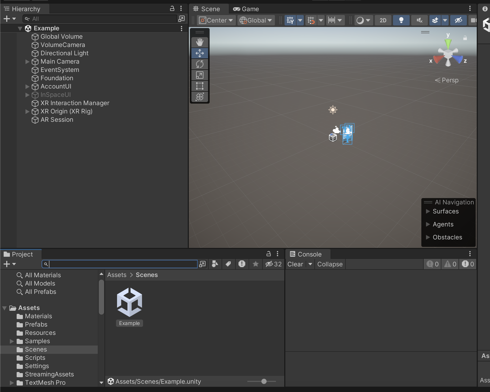

Press the Play button to start the editor runtime.

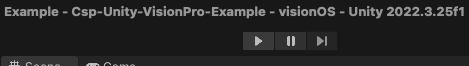

Sign Up if you don't already have an account.

Confirm Email if so.

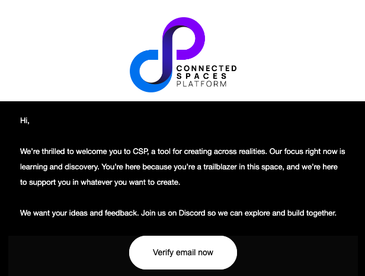

Sign In with a confirmed, existing account.

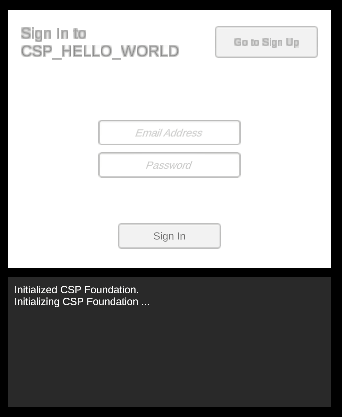

Create a Space if you don't have one already (Give it a name).

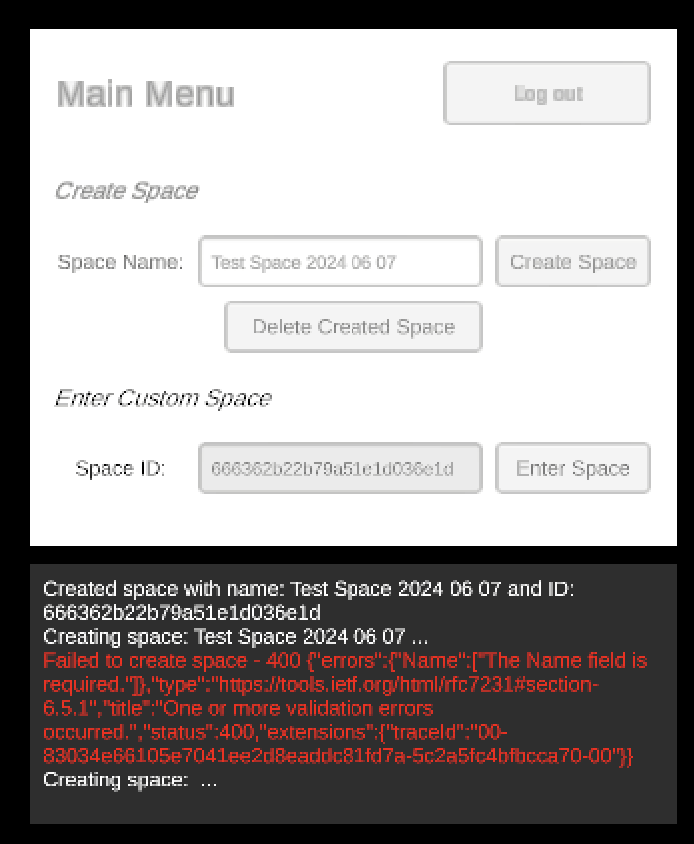

Enter an existing space. Move around using W/A/S/D, rotate using Q & E.

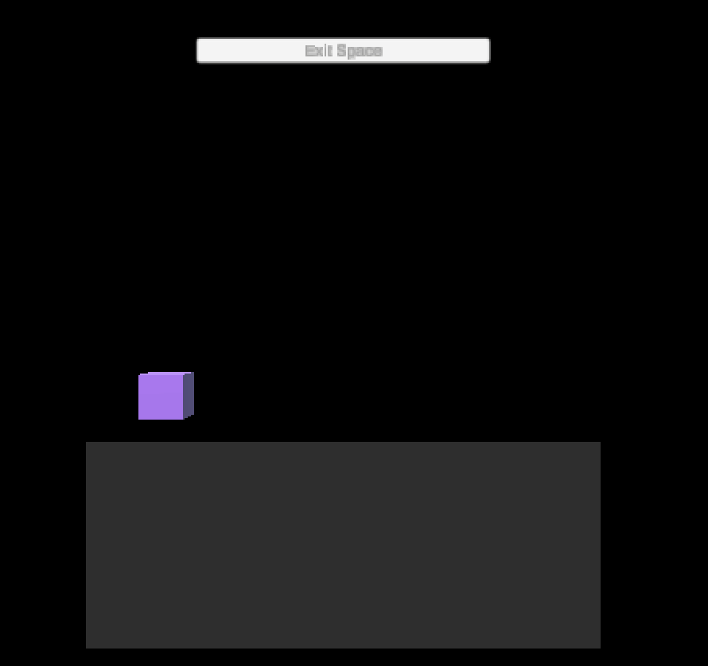

(Optional) With another copy of the project, sign in using a different account and see the other player appear and move around in real-time.

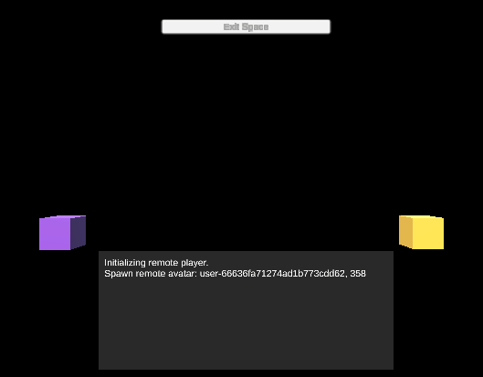

## Run on visionOS Simulator:

In Unity, build for the VisionOS Simulator (Target SDK).

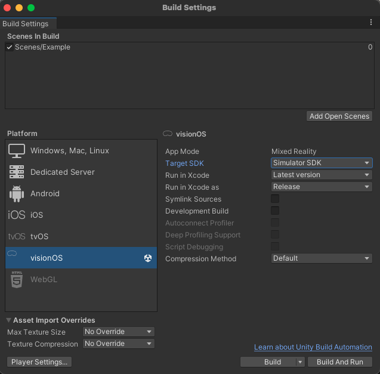

Run on VisionOS Simulator 1.1+.

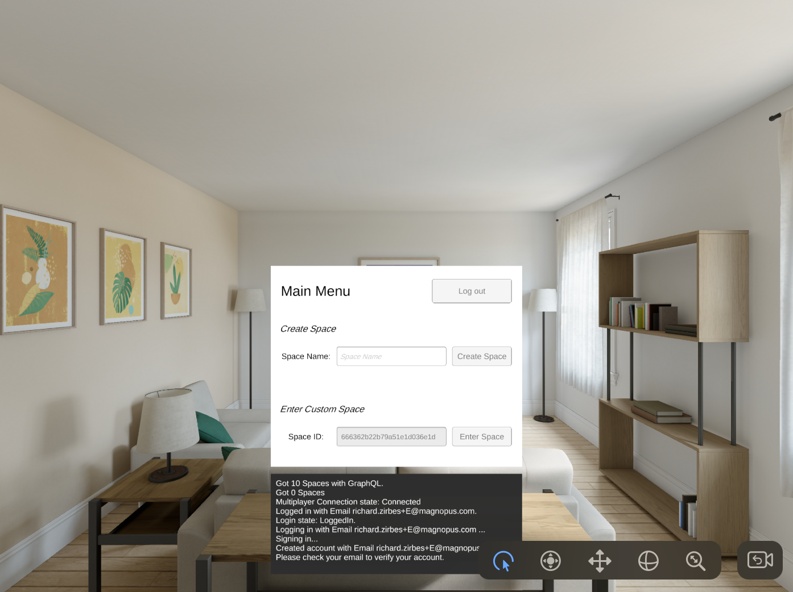

With multiple users signed into a space (eg: one using the Unity editor), the remote players can be seen moving around.

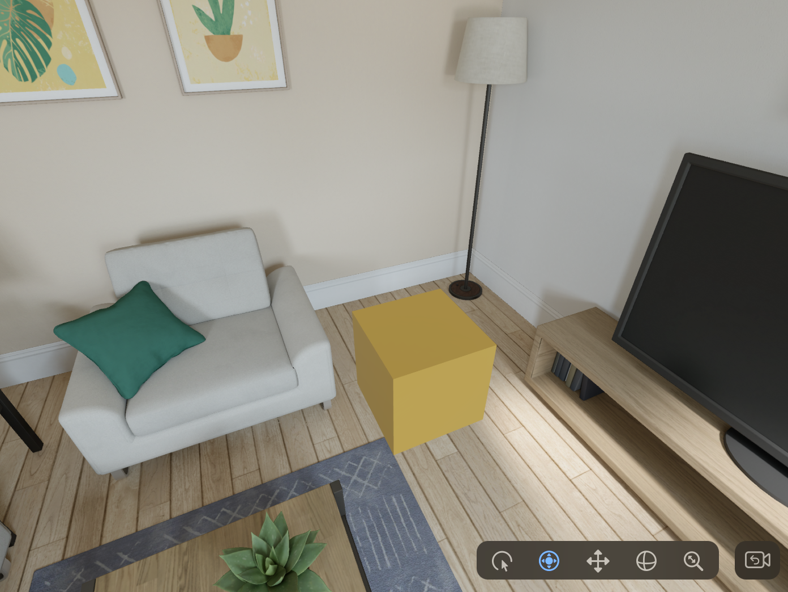

## Run on visionOS Device:

In Unity, build for VisionOS Device.

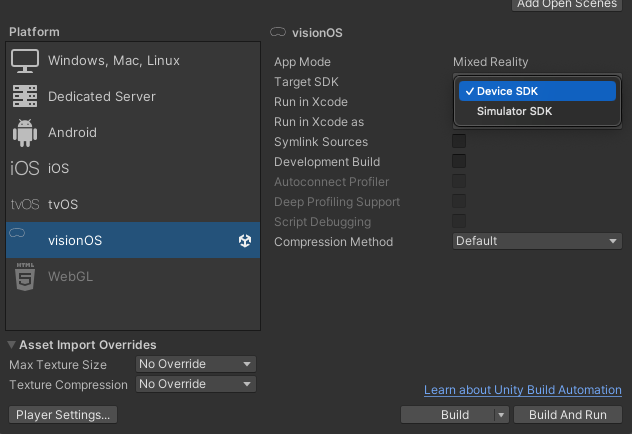

Check that the signing for Device is set up properly using a valid profile / account.

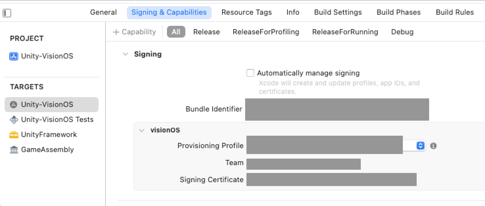

Run on visionOS Device.

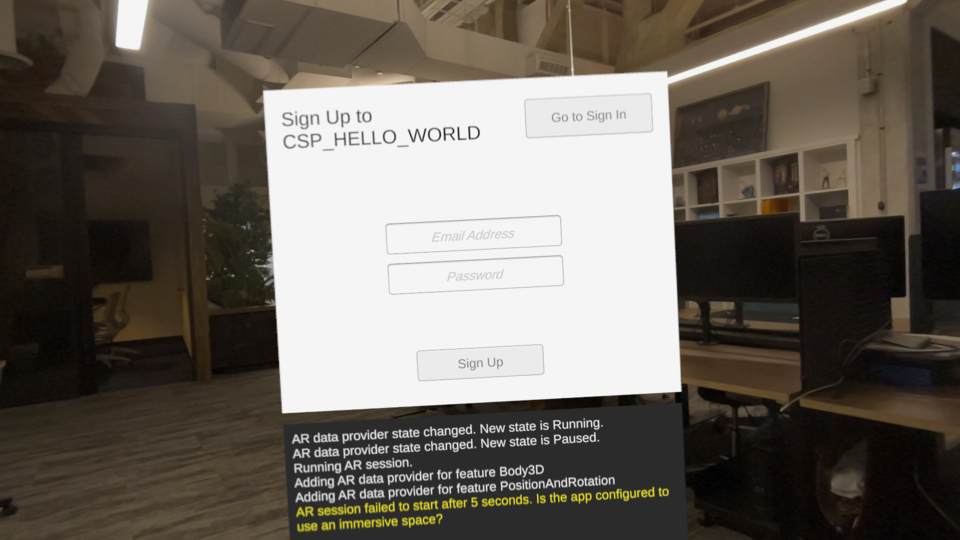

With multiple users signed into a space (eg: one using the Unity editor), the remote players can be seen moving around.

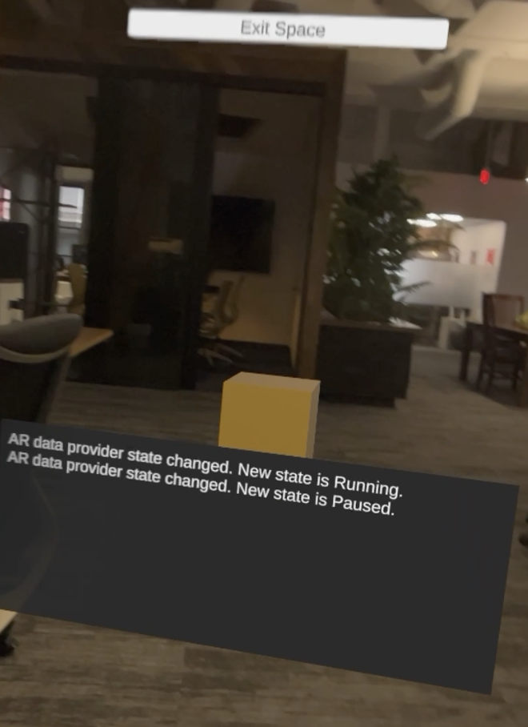

## References:
https://docs.unity3d.com/Manual/visionOS.html